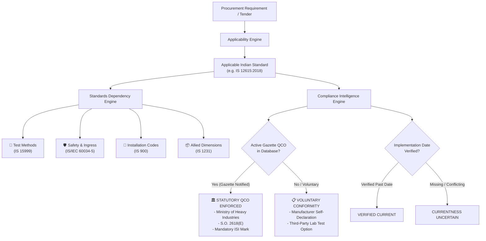

# Architecture: Compliance Intelligence & Statutory Certification Analysis

## 1. Executive Summary

A critical engineering and legal requirement for the Smart India Hackathon Problem Statement 26108 is maintaining absolute clarity between **Standard Technical Applicability** and **Statutory Certification Mandates (QCOs)**. 

In Indian public procurement:
1. An Indian Standard may be technically applicable to a product (e.g., establishing performance benchmarks, efficiency ratings, and test methods), yet the product may **not** be under a mandatory Quality Control Order (QCO).
2. Conversely, when a QCO is notified by a Central Ministry in the Gazette of India under the Bureau of Indian Standards Act, 2016, manufacturing, importing, stocking, or selling the product without a valid BIS Standard Mark (ISI mark) becomes a statutory violation.

NORMVAULT establishes the **Compliance Intelligence Engine** to provide automated, evidence-backed categorization of companion standards into actionable procurement categories while maintaining this strict legal boundary.

---

## 2. Core Functional Streams

NORMVAULT classifies referenced standards and downstream requirements into five specialized operational streams:

### 2.1 Test Method Standards (`TEST_METHOD`)
Companion standards prescribing testing protocols, sampling criteria, conditioning procedures, and tolerance limits.
- **Example**: `IS 15999 (Part 2/Sec 1)` for determining motor losses and efficiency.
- **Procurement Value**: Informs tender evaluation committees which specific laboratory test reports or factory acceptance tests (FAT) must be submitted by bidding vendors.

### 2.2 Safety & Protection Standards (`SAFETY_REQUIREMENT`)
Companion standards governing ingress protection, electrical insulation, dielectric breakdown, flameproof enclosures, and operator protection.
- **Example**: `IS/IEC 60034-5` for degrees of protection (IP55/IP65) and `IS 5571` for electrical apparatus in hazardous areas.
- **Procurement Value**: Identifies mandatory environmental safety thresholds based on the installation site's operating conditions.

### 2.3 Installation & Maintenance Practices (`INSTALLATION_PRACTICE`)
Codes of practice governing civil foundations, earthing, cable sizing, alignment, lubrication, and scheduled maintenance.
- **Example**: `IS 900:1990` for installation and maintenance of induction motors.
- **Procurement Value**: Directly generates installation compliance checklists for EPC contractors and site commissioning engineers.

### 2.4 Allied & Component Product Standards (`ALLIED_PRODUCT`)
Standards governing mating or constituent components, such as foot mountings, shaft dimensions, fasteners, terminal blocks, or conveyor belts.
- **Example**: `IS 1231:1974` for dimensions of three-phase foot-mounted induction motors.
- **Procurement Value**: Ensures mechanical interchangeability and compatibility across multi-vendor equipment packages.

### 2.5 Certification & Quality Control Orders (`CERTIFICATION_REQUIREMENT`)
Statutory gazette notifications and BIS licensing schemes governing commercial supply.
- **Schemes Supported**:
  - **Scheme I**: Standard Mark (ISI Licensing Scheme) under BIS (Conformity Assessment) Regulations.
  - **Scheme II**: Compulsory Registration Scheme (CRS) for electronics and IT goods under MeitY notifications.
  - **Scheme IV**: Certificate of Conformity for specialized batches.

---

## 3. Statutory QCO vs Voluntary Certification

### 3.1 Statutory Quality Control Orders (QCO)
When an applicable standard is governed by an active QCO:
- NORMVAULT extracts and displays the **Notifying Ministry** (e.g., *Ministry of Heavy Industries*, *Ministry of Steel*, *DPIIT*).
- Cites the **Gazette Notification Number** (e.g., *S.O. 2618(E)*) and **Notification Date**.
- Flags the requirement with a prominent amber badge: `STATUTORY QCO ENFORCED`.
- Notes that bidding vendors must possess an active, valid BIS license with a registered CML number.

### 3.2 Currentness Uncertainty Handling
Regulatory notifications frequently undergo amendments, extensions of enforcement dates, and phase-in schedules for micro, small, and medium enterprises (MSMEs). 

To prevent misinforming procurement officers:
- If a QCO record has not been cross-verified against the latest gazette corrigendum or official BIS Gazette portal, the system designates its status as:
  **`CURRENTNESS_UNCERTAIN`**.
- It provides an explicit warning:
  *"Gazette status unverified against latest BIS portal update. Verify active Gazette S.O. prior to tender disqualification."*

---

## 4. Legal Disclaimers & Procurement Guidance

> [!CAUTION]
> **Legal Disclaimer**:
> Standards dependency graphs, reference semantics, and QCO certification classifications generated by NORMVAULT are **technical decision-support artifacts** developed for procurement planning and specification drafting.
> 
> They do not constitute formal legal advice, official statutory interpretations of the Bureau of Indian Standards Act, 2016, or authoritative certifications. Procurement officers and bidders must verify active Gazette S.O. notifications and official BIS licensing status directly on the BIS Manakonline portal (`www.manakonline.in`) prior to tender disqualification or commercial award.
