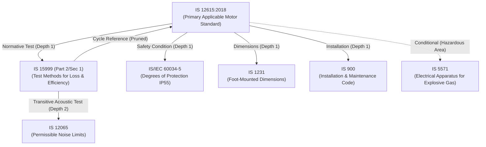

# Architecture: Standards Dependency Graph & Reference Intelligence

## 1. System Overview

Indian Standards (IS) published by the Bureau of Indian Standards (BIS) operate within an interconnected network of cross-references. A base equipment standard (such as `IS 12615:2018` for energy-efficient three-phase induction motors) does not specify all mechanical tolerances, insulation test procedures, or acoustic noise limits in isolation; instead, it normatively cites specialized companion standards (such as `IS 15999` for loss and efficiency testing, `IS/IEC 60034-5` for degrees of protection, and `IS 12065` for permissible noise limits).

The **NORMVAULT Standards Dependency Graph Engine** parses, tags, traverses, and visualizes this directed reference network while strictly upholding engineering and legal boundaries.

---

## 2. Core Architectural Principles

### 2.1 The Cardinal Boundary: Reference $\neq$ Procurement Mandate
> [!IMPORTANT]
> **Cardinal Principle of Standards Intelligence**:
> **Never equate "Referenced by standard" with "Mandatory for procurement."**
> A reference appearing within a standard clause does NOT automatically impose a mandatory contractual compliance obligation upon the procurement purchaser or manufacturer unless:
> 1. The clause syntax enforces mandatory normative compliance (`"shall conform to"` rather than `"for guidance see"`).
> 2. The procurement specification invokes the specific feature, operating condition, or test requirement that triggers the reference.
> 3. The referenced standard is governed by an applicable statutory Quality Control Order (QCO) issued by the relevant Ministry of the Government of India.

### 2.2 Direct (Depth 1) vs Transitive (Depth $\ge 2$) Separation
A standard referenced directly by the primary applicable standard is a **Depth 1 Direct Reference**. A standard cited by that referenced standard is a **Depth $\ge 2$ Transitive Reference**. NORMVAULT explicitly segregates these tiers in the data model and the user interface so procurement engineers never confuse immediate contractual testing requirements with deeply nested informational cross-citations.

---

## 3. Reference Semantics & Procurement Impact Classification

Every reference edge in NORMVAULT is typed with formal semantics and evaluated for procurement impact:

| Reference Semantics | Definition & Syntactic Criteria | Procurement Impact |
| :--- | :--- | :--- |
| **`NORMATIVE`** | Essential for meeting the requirements of the citing standard. Identified by imperious language (`"shall conform to"`, `"shall be tested in accordance with"`, `"compliance is mandatory"`). | `REQUIRED_SPECIFICATION`, `REQUIRED_TEST`, `REQUIRED_SAFETY_CONDITION`, `REQUIRED_INSTALLATION_CONDITION` |
| **`INFORMATIVE`** | Provided for background, guidance, or recommended good engineering practice. Identified by advisory language (`"may refer to"`, `"for general recommendations see"`, `"guidelines"`). | `INFORMATIONAL` |
| **`CONDITIONAL`** | Applicable only when specific design options or operating conditions are selected (e.g., hazardous locations, flameproof enclosures, marine environments, ambient temperatures $> 40^\circ\text{C}$). | `CONDITIONAL` |
| **`UNKNOWN`** | Reference lacking indexed clause text or containing neutral citations where binding status cannot be verified from available knowledge records. | `UNKNOWN` |

---

## 4. Directed Graph Traversal & Cycle Handling



### 4.1 Recursive Depth Bounding
Graph traversal is strictly bounded by `max_depth` (default = 3). Depth bounding prevents unbounded explosion of large standards trees, ensuring microsecond adjudication latencies.

### 4.2 Cycle Detection & Termination
In standards architecture, **circular citations are widespread**. For example:
- `IS 12615` (energy efficient motors) normatively references `IS 15999` (efficiency test methods).
- `IS 15999` (test methods) in turn cross-references `IS 12615` (standard ratings and tolerances).

If traversed naively, graph algorithms enter infinite recursion. NORMVAULT implements depth-first search (DFS) with explicit path tracking:
1. Maintain a traversal stack (`current_path`).
2. If `target_standard_number` is already present in `current_path`, a circular reference is identified.
3. The engine creates a cycle edge tagged with `is_cycle=True` and appends the cycle chain (e.g., `["IS 12615", "IS 15999", "IS 12615"]`) to `detected_cycles`.
4. **Recursion along that branch immediately halts**, preventing stack overflow and duplicate subtrees while preserving the cycle diagnostic for user inspection.

### 4.3 Handling Unindexed Target Standards
When a referenced standard is not present in the local database (e.g., an international standard `IEC 60079` or a historical standard awaiting ingestion):
- A synthetic `DependencyNode` is constructed with `is_indexed=False`.
- The node displays the standard title as `"[Unindexed Standard - Referenced by Clause X]"`.
- Traversal does not recurse into unindexed nodes, and the engine clearly flags unindexed dependencies in the compliance overview.

---

## 5. Algorithmic Implementation

The traversal is implemented in `app.services.dependencies.graph_builder.StandardsGraphBuilder`:

```python
def build_graph(
    self,
    root_standard_id: str,
    root_standard_number: str,
    max_depth: int = 3,
) -> StandardsDependencyGraph:
    # 1. Initialize root node at depth 0
    # 2. Execute bounded recursive DFS:
    #    - Fetch outgoing NormativeReference records from DB
    #    - Check current path for cycle: if target in path -> record cycle, do not recurse
    #    - Check depth limit: if depth >= max_depth -> do not recurse
    #    - For unindexed target -> emit unindexed node, do not recurse
    # 3. Partition references into direct (depth=1) vs transitive (depth >= 2)
    # 4. Return typed StandardsDependencyGraph
```

---

## 6. Verification and Performance

Benchmarking via `tests/test_dependency_benchmarks.py` confirms:
- Mean traversal latency: **$< 1.5\text{ ms}$** at depth 1, **$< 2.5\text{ ms}$** at depth 2, **$< 4.0\text{ ms}$** at depth 3.
- Cycle suppression: 100% of cyclic loops safely detected and pruned without recursion errors.
- Zero orphaned or fabricated edges.
