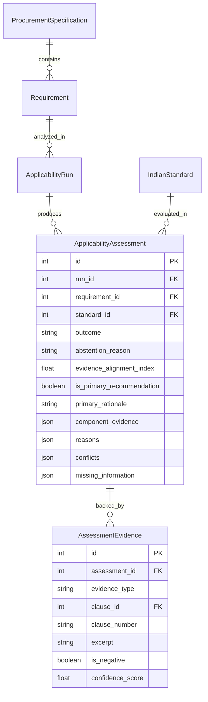

# Data Model: Applicability Analysis & Recommendation

## 1. Domain Entities

The Applicability domain is implemented in `app.models.applicability` and defined as follows:



---

## 2. Enums and Vocabulary

### `ApplicabilityOutcome`
- `APPLICABLE`: Strong evidence supports technical and legal applicability.
- `POSSIBLY_APPLICABLE`: Plausible match with category or operating profile, but secondary or incomplete.
- `NOT_APPLICABLE`: Fatal conflict or exclusion detected.
- `INSUFFICIENT_EVIDENCE`: Missing information or unindexed standard prevents determination.

### `AbstentionReason`
- `NONE`: No abstention; definitive determination reached.
- `INSUFFICIENT_EVIDENCE`: Critical parameter values missing from specification.
- `MULTIPLE_PLAUSIBLE_STANDARDS`: Two or more standards are equally plausible without distinguishing criteria.
- `SCOPE_UNCLEAR`: Standard scope text is unindexed or ambiguous.
- `MISSING_REQUIREMENT_INFORMATION`: Product category or operating environment is unspecified.
- `NO_APPLICABLE_CANDIDATE_FOUND`: No candidates satisfied minimal scope compatibility.

### `MatchLevel`
- `EXACT`: Direct specific alignment.
- `CATEGORY`: General category alignment without specific sub-features.
- `AMBIGUOUS`: Weak or overlapping keywords.
- `MISMATCH`: Explicit domain or product divergence.

### `ConflictSeverity`
- `FATAL`: Disqualifies the candidate completely (forces `NOT_APPLICABLE`).
- `WARNING`: Discrepancy noted but does not strictly invalidate standard (e.g. ambient temperature advisory).
- `EXCLUSION`: Standard text explicitly excludes the product or application.

---

## 3. Component Evidence Schema (`component_evidence`)

```json
{
  "scope_match": "EXACT",
  "product_match": "EXACT",
  "parameter_match": "COMPATIBLE",
  "application_match": "COMPATIBLE",
  "explicit_reference": false,
  "exclusion_match": false,
  "retrieval_score": 0.85,
  "evidence_quality": 0.95
}
```
