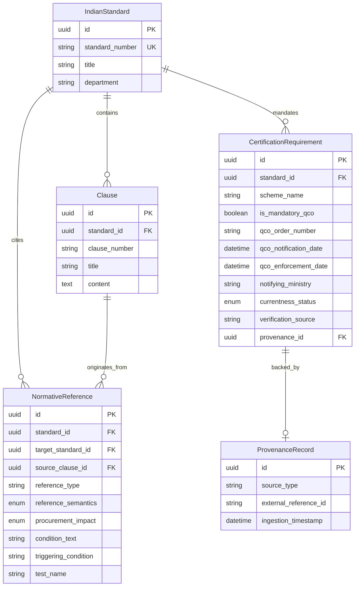

# Data Model: Standards Dependency & Compliance Intelligence

## 1. Entity-Relationship Overview



---

## 2. Core Enums

### 2.1 `ReferenceSemantics`
Defined in `app.models.reference`:
```python
class ReferenceSemantics(str, enum.Enum):
    NORMATIVE = "NORMATIVE"          # Mandatory conformance required by citing clause
    INFORMATIVE = "INFORMATIVE"      # Informational, guidance, or reference only
    CONDITIONAL = "CONDITIONAL"      # Mandatory only when specific options/conditions apply
    UNKNOWN = "UNKNOWN"              # Cannot be verified from available clause records
```

### 2.2 `ProcurementImpact`
Defined in `app.models.reference`:
```python
class ProcurementImpact(str, enum.Enum):
    REQUIRED_SPECIFICATION = "REQUIRED_SPECIFICATION"                # Governs base product specs
    REQUIRED_TEST = "REQUIRED_TEST"                                  # Test method standard required for FAT/testing
    REQUIRED_SAFETY_CONDITION = "REQUIRED_SAFETY_CONDITION"          # Safety threshold standard
    REQUIRED_INSTALLATION_CONDITION = "REQUIRED_INSTALLATION_CONDITION"# Installation practice code
    CERTIFICATION_REQUIREMENT = "CERTIFICATION_REQUIREMENT"          # Certification/QCO mandate
    INFORMATIONAL = "INFORMATIONAL"                                  # Background engineering reference
    CONDITIONAL = "CONDITIONAL"                                      # Active under specific operational triggers
    UNKNOWN = "UNKNOWN"                                              # Unverified procurement impact
```

### 2.3 `CertificationCurrentness`
Defined in `app.models.certification`:
```python
class CertificationCurrentness(str, enum.Enum):
    VERIFIED_CURRENT = "VERIFIED_CURRENT"          # Verified active against recent Gazette records
    CURRENTNESS_UNCERTAIN = "CURRENTNESS_UNCERTAIN"# Needs cross-verification against latest S.O.
    SUPERSEDED = "SUPERSEDED"                      # Superseded by newer notification
    WITHDRAWN = "WITHDRAWN"                        # Rescinded by publishing authority
```

---

## 3. Database Schema Extensions

### 3.1 `NormativeReference` Model (`app.models.reference`)
- `source_clause_id`: Foreign key referencing the originating `Clause`.
- `reference_semantics`: `Enum(ReferenceSemantics)`.
- `procurement_impact`: `Enum(ProcurementImpact)`.
- `condition_text`: Plain text extract of the triggering condition.
- `triggering_condition`: Machine-readable condition tag (e.g. `HAZARDOUS_AREA_GAS_GROUP_II`).
- `test_name`: Name of the specific test procedure (e.g. `"Efficiency by Summation of Losses"`).

### 3.2 `CertificationRequirement` Model (`app.models.certification`)
- `currentness_status`: `Enum(CertificationCurrentness)`.
- `applicable_product_category`: Scope string defining covered product variants.
- `verification_source`: Source of Gazette verification (e.g. `"Gazette of India, Extraordinary"`).
- `scope_condition`: Any exclusions or conditions stated in the Order.
- `provenance_id`: Foreign key referencing the audit `ProvenanceRecord`.

---

## 4. Pydantic API Schemas

Defined in `app.schemas.dependency`:

### 4.1 Graph Structures
- `DependencyNode`:
  - `standard_id`: Standard UUID or synthetic identifier
  - `standard_number`: BIS standard identifier (e.g. `"IS 12615:2018"`)
  - `title`: Official title of standard
  - `is_indexed`: Flag indicating whether full clause database records exist
  - `depth`: Traversal depth from root (0 = root, 1 = direct, $\ge 2$ = transitive)
  - `is_mandatory_qco`: Boolean flag for statutory QCO enforcement
- `DependencyEdge`:
  - `source_standard_number`: Parent standard
  - `target_standard_number`: Cited child standard
  - `reference_semantics`: `ReferenceSemantics`
  - `procurement_impact`: `ProcurementImpact`
  - `clause_number`: Originating clause in parent
  - `clause_title`: Title of originating clause
  - `condition_text`: Optional qualifying condition
  - `depth`: Edge hop depth
  - `is_cycle`: Flag indicating circular citation
- `StandardsDependencyGraph`:
  - `root_standard_number`: Identifier of query root
  - `nodes`: List of reachable `DependencyNode`
  - `edges`: List of typed `DependencyEdge`
  - `direct_references`: Filtered list of Depth 1 edges
  - `transitive_references`: Filtered list of Depth $\ge 2$ edges
  - `detected_cycles`: List of identified circular citation paths
  - `max_depth_reached`: Maximum depth encountered

### 4.2 Specialized Domain Schemas
- `TestMethodDependencyRead`: Test name, procedure standard, mandatory status, source clause.
- `SafetyRequirementDependencyRead`: Safety domain, referenced standard, condition, severity.
- `InstallationPracticeDependencyRead`: Code of practice standard, installation scope.
- `AlliedProductDependencyRead`: Allied component standard, dimensional/interface scope.
- `CertificationComplianceRead`: Statutory QCO flag, gazette S.O., notifying ministry, currentness.
- `ProcurementComplianceOverview`: Rollup combining graph, all specialized streams, and cycle diagnostics.
