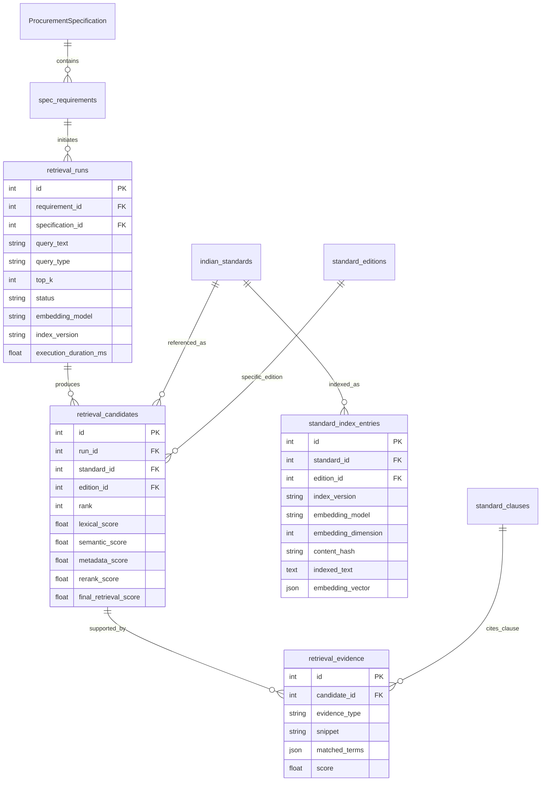

# Data Model: Retrieval Domain

## 1. Entity Relationship Overview

The Retrieval Domain models candidate discovery runs, candidate standards, multi-component scores, and traceable evidence slices.

---

## 2. Entities

### `RetrievalRun`
Represents an individual execution of the retrieval engine.
- **`id`**: Unique run primary key.
- **`requirement_id`**: Foreign key to `spec_requirements.id`.
- **`query_text`**: The normalized search string generated by the deterministic query constructor.
- **`status`**: State of run (`COMPLETED`, `FAILED`, `EMPTY_KB`).
- **`top_k`**: User-requested candidate limit.
- **`embedding_model` & `index_version`**: Reproducibility identifiers.
- **`execution_duration_ms`**: Pipeline latency measurement in milliseconds.

### `RetrievalCandidate`
An individual Indian Standard identified as a candidate for a requirement.
- **`rank`**: 1-based candidate ranking in this run.
- **`lexical_score`**: Normalized BM25 score $[0.0, 1.0]$.
- **`semantic_score`**: Dense vector cosine similarity $[0.0, 1.0]$.
- **`metadata_score`**: Score boost from lifecycle status and mandatory QCO $[0.0, 1.0]$.
- **`rerank_score`**: Multi-feature cross-channel reranker score $[0.0, 1.0]$.
- **`final_retrieval_score`**: Overall fused retrieval score $[0.0, 1.0]$.
- **`match_reasons`**: JSON list of explanatory strings.

### `RetrievalEvidence`
Concrete atomic evidence explaining why a candidate was retrieved.
- **`evidence_type`**: `LEXICAL_MATCH`, `SEMANTIC_SIMILARITY`, `SCOPE_OVERLAP`, `CLAUSE_MATCH`, `METADATA_MATCH`.
- **`snippet`**: Textual excerpt from the standard's title, scope, or clause.
- **`matched_terms`**: Exact tokens shared between query and standard.
- **`score`**: Relevance weight of this evidence slice.

### `StandardIndexEntry`
Searchable index projection of an `IndianStandard`.
- **`content_hash`**: SHA-256 hash of canonical representation to detect drift.
- **`indexed_text`**: Full canonical text document.
- **`embedding_vector`**: Dense unit vector serialized for dialect independence.
